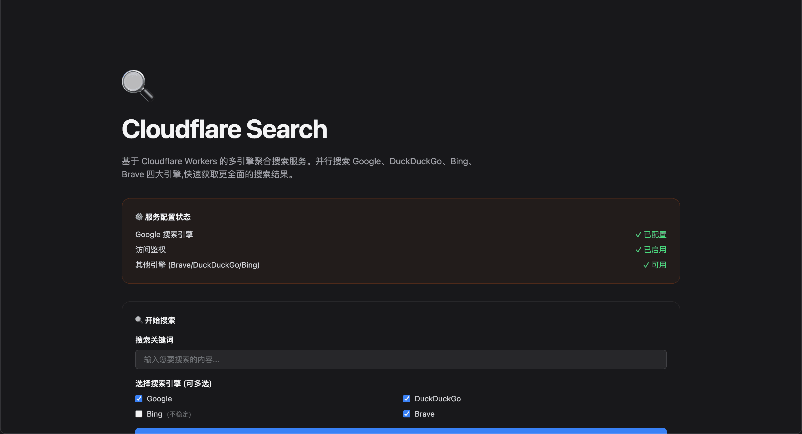

# Cloudflare Search

English | [中文](./README.zh.md)

> An aggregated search API service based on Cloudflare Workers

> Supports **MCP (Model Context Protocol)**, giving AI assistants (OpenClaw, Claude Code, Codex, OpenCode) real-time web search capabilities

[](https://sink.proddig.com/cloudflare-search-github)

## Features

- 🔍 **Multi-engine Aggregation** - Use multiple search engines at the same time (Google, Brave, DuckDuckGo, Bing)
- 🤖 **AI Enhanced (MCP)** - Native support for Model Context Protocol, one-click search tool integration for **OpenClaw** / **Claude Code** / **Codex**
- ⚡ **Parallel Search** - All search engines are requested concurrently for faster results
- 🛡️ **Fault Tolerance** - Failure of a single engine does not affect others; unresponsive engines are automatically marked
- ⏱️ **Timeout Control** - Configurable request timeout to avoid long waits
- 🔒 **Token Authentication** - Supports token auth to protect the service from abuse
- 🌍 **CORS Support** - Full cross-origin resource sharing support
- 🎨 **Web Interface** - Provides a clean search UI for easy testing
- ⚡ **Zero-cost Operation** - Cloudflare Workers free tier supports 100,000 requests per day

## Page Preview



## MCP Integration: Use in OpenClaw / Claude Code / AI Agents

With MCP (Model Context Protocol), AI assistants can directly call your search service and get real-time search results.

### Installation and Configuration

#### 1. Deploy the Service

First, follow the guide to [Deploy Cloudflare Search](#installation-methods)

#### 2. Add MCP Server Configuration

Edit your config file ([configuration guide](https://modelcontextprotocol.io/quickstart/user)):

- **OpenClaw**: `~/.openclaw/openclaw.json`
- **Claude Code**: `~/.claude/config.json` / `~/.claude.json`
- **Claude Desktop macOS**: `~/Library/Application Support/Claude/claude_desktop_config.json`
- **Claude Desktop Windows**: `%APPDATA%\Claude\claude_desktop_config.json`

```json
{
	"mcpServers": {
		"cloudflare-search": {
			"command": "npx",
			"args": ["-y", "@yrobot/cf-search-mcp"],
			"env": {
				"CF_SEARCH_URL": "https://your-worker.workers.dev",
				"CF_SEARCH_TOKEN": "your-token-here"
			}
		}
	}
}
```

**Environment Variables**:

- `CF_SEARCH_URL`: Worker deployment URL (required)
- `CF_SEARCH_TOKEN`: Auth token (required if your Worker has `TOKEN` configured)

#### 3. Verify Installation

- **OpenClaw**: Run `openclaw gateway restart` + `openclaw mcp list` and check that `cloudflare-search` appears
- **Claude Code**:
	- Run `/mcp` in Claude Code, and you should see the `cloudflare-search` tool.
	- Or run `claude mcp list`; seeing `cloudflare-search: npx -y @yrobot/cf-search-mcp@latest - ✓ Connected` means setup is successful

## Installation Methods

### Method 1: One-click Deployment (Recommended)

Click the "Deploy to Cloudflare Workers" button above and follow the prompts.

### Method 2: Use Wrangler CLI

```bash
# 1. Install Wrangler
npm install -g wrangler

# 2. Login to Cloudflare
wrangler login

# 3. Clone the repository
git clone https://github.com/Yrobot/cloudflare-search.git
cd cloudflare-search

# 4. Deploy
wrangler deploy
```

### Method 3: Use Cloudflare Dashboard

1. Sign in to [Cloudflare Dashboard](https://dash.cloudflare.com/)
2. Go to **Workers & Pages**
3. Click **Create Application** > **Create Worker**
4. Click **Upload** to upload your local code folder
	 - Select the cloned `cloudflare-search` folder
	 - Or manually copy `worker.js`, `envs.js`, `utils/`, and other files
5. Click **Save and Deploy**

### Get Access URL

After deployment, you will get a Worker URL:

```
https://your-worker-name.your-subdomain.workers.dev
```

**Note**: The default domain may not be directly accessible in some regions. It is recommended to bind your own custom domain.

## Usage

### Method 1: Web Interface

Open your Worker URL directly and enter search keywords in the web UI:

```
https://$YOUR-DOMAIN/
```

### Method 2: API Request (GET)

Search using query parameters:

```bash
# Basic search
curl "https://$YOUR-DOMAIN/search?q=cloudflare"

# Specify search engines
curl "https://$YOUR-DOMAIN/search?q=cloudflare&engines=google,brave"

# Use token authentication (if TOKEN env var is configured)
curl "https://$YOUR-DOMAIN/search?q=cloudflare&token=$YOUR-TOKEN"
```

### Method 3: API Request (POST)

Submit search by POST form:

```bash
curl -X POST "https://$YOUR-DOMAIN/search" \
	-d "q=cloudflare" \
	-d "engines=google,brave"
	-d "token=$YOUR-TOKEN" # if TOKEN env var is configured
```

## API Reference

### `/search` Endpoint

Used to execute search queries and return aggregated results.

#### Request Parameters

| Parameter     | Type     | Required | Description                                                | Example          |
| ------------- | -------- | -------- | ---------------------------------------------------------- | ---------------- |
| `q` / `query` | `string` | yes      | Search keyword                                             | `cloudflare`     |
| `engines`     | `string` | no       | Specify search engines, separated by commas               | `google,brave`   |
| `token`       | `string` | no/yes   | Access token (required when `TOKEN` env var is configured) | `$YOUR-TOKEN`    |

**Supported Search Engines**:

- `google` - Google Search (requires API Key configuration)
- `brave` - Brave Search
- `duckduckgo` - DuckDuckGo Search
- `bing` - Bing Search

#### Response Value

```typescript
{
	query: string;                    // Search keyword
	number_of_results: number;        // Total number of results
	enabled_engines: string[];        // Enabled search engine list
	unresponsive_engines: string[];   // Unresponsive search engine list
	results: Array<{
		title: string;                  // Result title
		description: string;            // Result description
		url: string;                    // Result link
		engine: string;                 // Source engine
	}>;
}
```

#### Request Examples

```bash
# GET request
curl "https://$YOUR-DOMAIN/search?q=cloudflare&engines=google,brave"

# POST request
curl -X POST "https://$YOUR-DOMAIN/search" \
	-H "Content-Type: application/x-www-form-urlencoded" \
	-d "q=cloudflare&engines=google,brave"
```

#### Response Example

```json
{
	"query": "cloudflare",
	"number_of_results": 15,
	"enabled_engines": ["google", "brave", "duckduckgo"],
	"unresponsive_engines": [],
	"results": [
		{
			"title": "Cloudflare - The Web Performance & Security Company",
			"description": "Cloudflare is on a mission to help build a better Internet...",
			"url": "https://www.cloudflare.com/",
			"engine": "google"
		},
		{
			"title": "Cloudflare Workers",
			"description": "Deploy serverless code instantly across the globe...",
			"url": "https://workers.cloudflare.com/",
			"engine": "brave"
		}
	]
}
```

## Search Engine Notes

### Supported Search Engines

| Engine         | Description                  | Configuration Required          | Enabled by Default |
| -------------- | ---------------------------- | ------------------------------- | ------------------ |
| **Google**     | Google Custom Search API     | Requires `GOOGLE_API_KEY` and `GOOGLE_CX` | yes                |
| **Brave**      | Brave Search API             | -                               | yes                |
| **DuckDuckGo** | DuckDuckGo Instant Answer API | -                             | yes                |
| **Bing**       | Bing Search                  | -                               | no (unstable results) |

### Basic Working Approach

1. **Parallel Requests**: All enabled search engines are requested concurrently to improve response speed
2. **Timeout Control**: Timeout of a single engine does not affect others; default timeout is 3 seconds
3. **Result Aggregation**: Merge all successfully returned results and mark their source engine
4. **Fault Tolerance**: Record unresponsive engines and return partial results instead of failing completely

## Environment Variable Configuration

### Environment Variables

| Variable Name      | Type     | Default  | Description                                         |
| ------------------ | -------- | -------- | --------------------------------------------------- |
| `DEFAULT_TIMEOUT`  | `string` | `"3000"` | Timeout per search engine request (milliseconds)   |
| `GOOGLE_API_KEY`   | `string` | `null`   | https://console.cloud.google.com/apis/credentials  |
| `GOOGLE_CX`        | `string` | `null`   | https://programmablesearchengine.google.com/       |
| `TOKEN`            | `string` | `null`   | Access token. Enables auth when configured to prevent abuse |

**Notes**:

- Google Custom Search API free tier is limited to 100 requests per day
- After `TOKEN` is configured, all requests must provide a valid token

### Configuration Methods

#### Method 1: `wrangler.toml` File

Edit the `[vars]` section in `wrangler.toml`:

```toml
[vars]
GOOGLE_API_KEY = "your-google-api-key"
GOOGLE_CX = "your-google-custom-search-cx"
DEFAULT_TIMEOUT = "3000"
TOKEN = "your-secret-token-here"
```

#### Method 2: Cloudflare Dashboard

1. Go to the Worker settings page
2. Find the **Environment Variables** section
3. Add variables and save

## Use Cases

### 1. Aggregated Search Service

Build your own aggregated search API and combine results from multiple search engines:

```javascript
const response = await fetch(
	"https://$YOUR-DOMAIN/search?q=javascript&engines=google,brave",
);
const data = await response.json();
console.log(`Found ${data.number_of_results} results`);
```

### 2. Frontend Search Feature

Add search functionality to your website or app:

```javascript
async function search(query) {
	const response = await fetch(
		`https://$YOUR-DOMAIN/search?q=${encodeURIComponent(query)}`,
	);
	const data = await response.json();
	return data.results;
}
```

### 3. Data Collection and Analysis

Collect results from multiple search engines for comparative analysis:

```javascript
const engines = ["google", "brave", "duckduckgo"];
const results = await fetch(
	`https://$YOUR-DOMAIN/search?q=AI&engines=${engines.join(",")}`,
);
const data = await results.json();

// Group by engine
const byEngine = data.results.reduce((acc, result) => {
	acc[result.engine] = acc[result.engine] || [];
	acc[result.engine].push(result);
	return acc;
}, {});
```

## MCP Integration

With MCP (Model Context Protocol), AI assistants can directly call your search service and get real-time search results.

## Notes and Reminders

### 🚨 Important Notes

1. **Use a Custom Domain**
	 - The default Cloudflare `*.workers.dev` domain may be inaccessible in some regions
	 - It is **strongly recommended** to bind your own domain for a better access experience
	 - In Worker settings, click **Triggers** > **Add Custom Domain** to add a custom domain

2. **Search Engine Limits**
	 - Google API free tier is limited to 100 requests per day
	 - Other search engines generally do not have strict limits, but please use responsibly
	 - Frequent requests may cause temporary rate limiting

3. **Timeout Settings**
	 - Default timeout per engine is 3 seconds
	 - Can be adjusted with `DEFAULT_TIMEOUT`
	 - Do not set it too high to avoid long overall response times

### 🔒 Security Configuration

#### Enable Authentication

1. Configure the `TOKEN` environment variable to protect your service from abuse:

- Configure `TOKEN` in `wrangler.toml`
- Configure `TOKEN` in Cloudflare Worker Dashboard

2. Pass token in requests:

```bash
# Access homepage
https://$YOUR-DOMAIN?token=$YOUR-TOKEN

# Request API with token parameter in query/body
curl "https://$YOUR-DOMAIN/search?q=cloudflare&token=$YOUR-TOKEN"

curl -X POST "https://$YOUR-DOMAIN/search" \
	-d "q=cloudflare" \
	-d "token=$YOUR-TOKEN"
```

## FAQ

### Q: Why do some search engines return empty results?

A: Possible reasons:

- Search engine API is temporarily unavailable or timed out
- No relevant results for the search keyword
- Search engine has rate-limited access
- Google requires API Key configuration before use

You can check the `unresponsive_engines` field in the response to see which engines did not respond.

### Q: How can I improve search speed?

A: Recommendations:

- Reduce the number of enabled search engines and only use the engines you need
- Adjust timeout (`DEFAULT_TIMEOUT`) appropriately

### Q: Why is Bing search disabled by default?

A: Bing search results are currently not stable enough, and may return content with low relevance to the query. If needed, you can manually specify `engines=bing` in requests or modify `DEFAULT_ENGINES` in `envs.js`.

### Q: How can I protect the service from abuse?

A: It is recommended to configure the `TOKEN` environment variable to enable authentication:

1. Set `TOKEN = "your-random-token"` in `wrangler.toml`
2. Or add it in Environment Variables in Cloudflare Dashboard
3. After configuration, all requests must provide a valid token

Authentication failure returns a 401 error.

## Disclaimer

This project is for learning and research purposes only. Users must comply with the following:

1. **Lawful Use** - Only use for legal search purposes. Do not use for illegal or infringing activities
2. **Terms of Service** - Comply with the terms of Cloudflare Workers and each search engine
3. **API Limits** - Follow usage limits and quotas of each search engine API
4. **Use at Your Own Risk** - Any consequences from using this service are the user's responsibility
5. **Commercial Use** - For commercial use, ensure compliance with relevant laws, regulations, and service terms

## Contributing

Issues and Pull Requests are welcome!

## License

[GPL-3 License](LICENSE)

## Related Links

- [Project GitHub](https://github.com/Yrobot/cloudflare-search)
- [Cloudflare Workers Docs](https://developers.cloudflare.com/workers/)
- [Google Custom Search API](https://developers.google.com/custom-search/v1/overview)

## Support the Project

If this project helps you, you can buy the author a coffee ☕

<image src="https://yrobot.top/donate_wx.jpeg" width="300"/>
